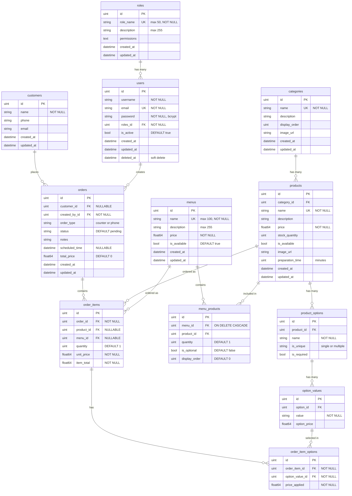

# WacDo — Entity Relationship Documentation

## Data Model Overview

WacDo uses 12 tables organized into three domains: **User Management**, **Product & Menu Management**, and **Customer & Order Management**.

---

## User Management

### Roles

Defines access levels for staff users. Three roles are used: `admin`, `preparation`, `accueil`.

```
roles
┌──────────────┬──────────┬──────────────────────────────────────┐
│ Column       │ Type     │ Constraints                          │
├──────────────┼──────────┼──────────────────────────────────────┤
│ id           │ uint     │ PK, auto-increment                   │
│ role_name    │ string   │ UNIQUE, NOT NULL, max 50             │
│ description  │ string   │ max 255                              │
│ permissions  │ text     │ Free-text permissions description     │
│ created_at   │ datetime │                                      │
│ updated_at   │ datetime │                                      │
└──────────────┴──────────┴──────────────────────────────────────┘
```

### Users

Internal staff members who operate the back-office.

```
users
┌──────────────┬──────────┬──────────────────────────────────────┐
│ Column       │ Type     │ Constraints                          │
├──────────────┼──────────┼──────────────────────────────────────┤
│ id           │ uint     │ PK, auto-increment                   │
│ username     │ string   │ NOT NULL                             │
│ email        │ string   │ UNIQUE (where deleted_at IS NULL)    │
│ password     │ string   │ NOT NULL (bcrypt hash)               │
│ roles_id     │ uint     │ FK → roles(id), NOT NULL             │
│ is_active    │ bool     │ DEFAULT true                         │
│ created_at   │ datetime │                                      │
│ updated_at   │ datetime │                                      │
│ deleted_at   │ datetime │ NULLABLE, GORM soft delete           │
└──────────────┴──────────┴──────────────────────────────────────┘
```

**Relationships:** `users.roles_id` → `roles.id` (many-to-one)

**Soft delete:** Users use GORM soft delete. Deleted rows are hidden from queries but preserved so that historical orders retain a valid `created_by` reference. The email unique index is partial (`WHERE deleted_at IS NULL`) so a deleted user's email can be reused by a new account. `is_active` is a separate reversible deactivation flag.

---

## Product & Menu Management

### Categories

Groups products for display and filtering on the kiosk.

```
categories
┌───────────────┬──────────┬──────────────────────────────────────┐
│ Column        │ Type     │ Constraints                          │
├───────────────┼──────────┼──────────────────────────────────────┤
│ id            │ uint     │ PK, auto-increment                   │
│ name          │ string   │ UNIQUE, NOT NULL                     │
│ description   │ string   │                                      │
│ display_order │ uint     │                                      │
│ image_url     │ string   │                                      │
│ created_at    │ datetime │                                      │
│ updated_at    │ datetime │                                      │
└───────────────┴──────────┴──────────────────────────────────────┘
```

### Products

Single orderable items with pricing, stock, and availability.

```
products
┌──────────────────┬──────────┬──────────────────────────────────────┐
│ Column           │ Type     │ Constraints                          │
├──────────────────┼──────────┼──────────────────────────────────────┤
│ id               │ uint     │ PK, auto-increment                   │
│ category_id      │ uint     │ FK → categories(id)                  │
│ name             │ string   │ UNIQUE, NOT NULL                     │
│ description      │ string   │                                      │
│ price            │ float64  │ NOT NULL                             │
│ stock_quantity   │ uint     │                                      │
│ is_available     │ bool     │                                      │
│ image_url        │ string   │                                      │
│ preparation_time │ uint     │ Minutes                              │
│ created_at       │ datetime │                                      │
│ updated_at       │ datetime │                                      │
└──────────────────┴──────────┴──────────────────────────────────────┘
```

**Relationships:** `products.category_id` → `categories.id` (many-to-one)

### Product Options

Customization groups for a product (e.g., "Size", "Extra Toppings").

```
product_options
┌──────────────┬──────────┬──────────────────────────────────────┐
│ Column       │ Type     │ Constraints                          │
├──────────────┼──────────┼──────────────────────────────────────┤
│ id           │ uint     │ PK, auto-increment                   │
│ product_id   │ uint     │ FK → products(id)                    │
│ name         │ string   │ NOT NULL                             │
│ is_unique    │ string   │ "single" or "multiple"               │
│ is_required  │ bool     │                                      │
└──────────────┴──────────┴──────────────────────────────────────┘
```

**Relationships:** `product_options.product_id` → `products.id` (many-to-one)

### Option Values

Selectable values within an option group (e.g., "Small", "Medium", "Large").

```
option_values
┌──────────────┬──────────┬──────────────────────────────────────┐
│ Column       │ Type     │ Constraints                          │
├──────────────┼──────────┼──────────────────────────────────────┤
│ id           │ uint     │ PK, auto-increment                   │
│ option_id    │ uint     │ FK → product_options(id)             │
│ value        │ string   │ NOT NULL                             │
│ option_price │ float64  │ Additional cost                      │
└──────────────┴──────────┴──────────────────────────────────────┘
```

**Relationships:** `option_values.option_id` → `product_options.id` (many-to-one)

### Menus

Combo meals bundling multiple products at a fixed price.

```
menus
┌──────────────┬──────────┬──────────────────────────────────────┐
│ Column       │ Type     │ Constraints                          │
├──────────────┼──────────┼──────────────────────────────────────┤
│ id           │ uint     │ PK, auto-increment                   │
│ name         │ string   │ UNIQUE, NOT NULL, max 100            │
│ description  │ string   │ max 255                              │
│ price        │ float64  │ NOT NULL                             │
│ is_available │ bool     │ DEFAULT true                         │
│ created_at   │ datetime │                                      │
│ updated_at   │ datetime │                                      │
└──────────────┴──────────┴──────────────────────────────────────┘
```

### Menu Products

Join table linking menus to their constituent products.

```
menu_products
┌───────────────┬──────────┬──────────────────────────────────────┐
│ Column        │ Type     │ Constraints                          │
├───────────────┼──────────┼──────────────────────────────────────┤
│ id            │ uint     │ PK, auto-increment                   │
│ menu_id       │ uint     │ FK → menus(id), ON DELETE CASCADE    │
│ product_id    │ uint     │ FK → products(id)                    │
│ quantity      │ uint     │ DEFAULT 1                            │
│ is_optional   │ bool     │ DEFAULT false                        │
│ display_order │ uint     │ DEFAULT 0                            │
└───────────────┴──────────┴──────────────────────────────────────┘
```

**Relationships:** `menu_products.menu_id` → `menus.id`, `menu_products.product_id` → `products.id` (many-to-many join)

---

## Customer & Order Management

### Customers

External customers who place orders.

```
customers
┌──────────────┬──────────┬──────────────────────────────────────┐
│ Column       │ Type     │ Constraints                          │
├──────────────┼──────────┼──────────────────────────────────────┤
│ id           │ uint     │ PK, auto-increment                   │
│ name         │ string   │ NOT NULL                             │
│ phone        │ string   │                                      │
│ email        │ string   │                                      │
│ created_at   │ datetime │                                      │
│ updated_at   │ datetime │                                      │
└──────────────┴──────────┴──────────────────────────────────────┘
```

### Orders

Customer orders created by staff members.

```
orders
┌────────────────┬──────────┬──────────────────────────────────────┐
│ Column         │ Type     │ Constraints                          │
├────────────────┼──────────┼──────────────────────────────────────┤
│ id             │ uint     │ PK, auto-increment                   │
│ customer_id    │ *uint    │ FK → customers(id), NULLABLE         │
│ created_by_id  │ uint     │ FK → users(id)                       │
│ order_type     │ string   │ "counter" or "phone"                 │
│ status         │ string   │ DEFAULT "pending"                    │
│ notes          │ string   │ Free-text for kitchen                │
│ scheduled_time │ *datetime│ NULLABLE, requested delivery time    │
│ total_price    │ float64  │ DEFAULT 0, server-computed           │
│ created_at     │ datetime │                                      │
│ updated_at     │ datetime │                                      │
└────────────────┴──────────┴──────────────────────────────────────┘
```

**Status workflow:** `pending → preparing → prepared → delivered` | `pending → cancelled`

**Relationships:**
- `orders.customer_id` → `customers.id` (optional many-to-one)
- `orders.created_by_id` → `users.id` (many-to-one)

### Order Items

Line items within an order. Each references either a product or a menu (exactly one).

```
order_items
┌──────────────┬──────────┬──────────────────────────────────────┐
│ Column       │ Type     │ Constraints                          │
├──────────────┼──────────┼──────────────────────────────────────┤
│ id           │ uint     │ PK, auto-increment                   │
│ order_id     │ uint     │ FK → orders(id)                      │
│ product_id   │ *uint    │ FK → products(id), NULLABLE          │
│ menu_id      │ *uint    │ FK → menus(id), NULLABLE             │
│ quantity     │ uint     │ DEFAULT 1                            │
│ unit_price   │ float64  │ Price snapshot at order time          │
│ item_total   │ float64  │ (unit_price + options) × quantity     │
└──────────────┴──────────┴──────────────────────────────────────┘
```

**Relationships:**
- `order_items.order_id` → `orders.id` (many-to-one, CASCADE)
- `order_items.product_id` → `products.id` (optional)
- `order_items.menu_id` → `menus.id` (optional)

### Order Item Options

Selected option values for an order item, with price snapshot.

```
order_item_options
┌─────────────────┬──────────┬──────────────────────────────────────┐
│ Column          │ Type     │ Constraints                          │
├─────────────────┼──────────┼──────────────────────────────────────┤
│ id              │ uint     │ PK, auto-increment                   │
│ order_item_id   │ uint     │ FK → order_items(id)                 │
│ option_value_id │ uint     │ FK → option_values(id)               │
│ price_applied   │ float64  │ Price snapshot at order time          │
└─────────────────┴──────────┴──────────────────────────────────────┘
```

**Relationships:**
- `order_item_options.order_item_id` → `order_items.id` (many-to-one, CASCADE)
- `order_item_options.option_value_id` → `option_values.id` (many-to-one)

---

## Relationship Summary

```
roles 1──→ N users
                 ↓
categories 1──→ N products 1──→ N product_options 1──→ N option_values
                 ↓                                            ↓
                 ├──→ N menu_products ←── N menus             │
                 ↓                         ↓                  │
              orders 1──→ N order_items 1──→ N order_item_options
                 ↑              ↑                             ↑
              customers    (product OR menu)           (option_value)
```

---

## Example: Order Structure

```
Order #1001 (counter, pending)
├── Item 1: Margherita Pizza × 1 — €10.00
│     ├── Option: Size = Large (+€3.00)
│     ├── Option: Topping = Extra Cheese (+€1.50)
│     └── Option: Topping = Pepperoni (+€2.00)
│     → item_total = (10.00 + 3.00 + 1.50 + 2.00) × 1 = €16.50
│
└── Item 2: Classic Menu × 2 — €8.99
      → item_total = 8.99 × 2 = €17.98

→ total_price = €34.48
```

---

## Design Notes

- **Permissions:** The original design called for a separate `permissions` table with a `role_permissions` glue table. In practice, RBAC is enforced via middleware that checks the role name directly (admin/preparation/accueil). The `permissions` text field on `roles` is kept for documentation purposes.
- **Price snapshots:** `order_items.unit_price` and `order_item_options.price_applied` capture prices at order time, so changing a product's price doesn't affect past orders.
- **Soft delete:** Used for `users` only (GORM `deleted_at`), to preserve order audit trails. `is_active` handles reversible deactivation; soft delete is for irreversible removal. All other entities use hard delete.
- **Last-admin protection:** The last active admin cannot be deleted or deactivated — enforced in `DeleteUser` and `ToggleUserStatus`.

## ERD Diagram


